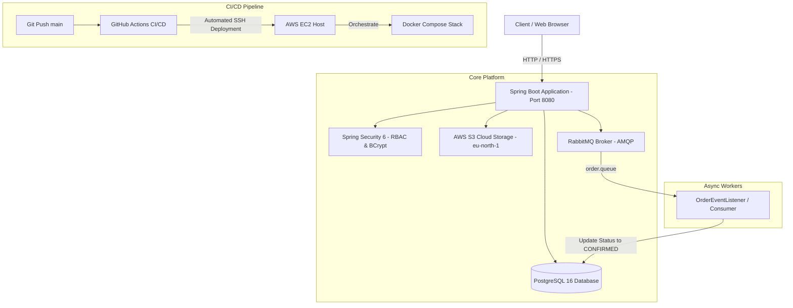

# 🛒 MasteryMarket — Distributed E-Commerce Marketplace Platform


**MasteryMarket** is a cloud-native, distributed e-commerce marketplace platform built with **Spring Boot 3**, featuring **Event-Driven Architecture (EDA)**, asynchronous message processing via **RabbitMQ**, cloud object storage integration with **AWS S3**, role-based access control (RBAC), and automated zero-downtime deployment pipelines on **AWS EC2** using **Docker Compose** and **GitHub Actions**.

---

## 📐 System Architecture



---

## 🔥 Key Technical Features

### 🛡️ 1. Enterprise Security & Access Control (Spring Security 6)
- **Role-Based Access Control (RBAC):** Strict separation of privileges between `ROLE_ADMIN` (Product management, system audit) and `ROLE_USER` (Checkout, personal order history).
- **Password Hashing:** Passwords hashed using **BCrypt** salt-based hashing function.
- **Custom UserDetails Service:** Dynamic user authorization integrated directly with JPA persistence layer.
- **Form-Based Authentication & Session Management:** Integrated login/logout workflows with Thymeleaf Security Directives.

### 🐇 2. Event-Driven Asynchronous Processing (RabbitMQ)
- **Decoupled Architecture:** Order creation emits non-blocking domain events (`OrderCreatedEvent`) to RabbitMQ exchanges and queues (`order.queue`).
- **Asynchronous Consumer:** Background event listener consumes order payloads asynchronously, triggering fulfillment workflows (e.g., payment verification, notification dispatch) and transitioning order state from `PENDING` to `CONFIRMED`.

### ☁️ 3. AWS S3 Cloud Object Storage
- Direct integration with **AWS S3 Bucket (`eu-north-1` Stockholm region)** using MinIO-compatible S3 Java SDK.
- Media assets and product images are served directly via Amazon cloud infrastructure.

### 🚀 4. Automated CI/CD & Cloud Infrastructure (GitHub Actions + Docker Compose + AWS EC2)
- **Continuous Integration:** Automated build and artifact packaging on GitHub runner (`-DskipTests` for pipeline efficiency).
- **Continuous Deployment:** Zero-downtime automated deployment over SSH to **AWS EC2** Linux instance.
- **Containerization:** Modular orchestration of `postgres-db`, `rabbitmq`, `minio`, and `spring-app` using **Docker Compose**.
- **Memory & Resource Management:** Configured virtual memory allocation on EC2 combined with safe automated Docker cache pruning (`docker system prune -f`).

---

## 🛠️ Technology Stack

| Domain | Technology |
| :--- | :--- |
| **Language & Framework** | Java 17, Spring Boot 3.3.5 |
| **Database & ORM** | PostgreSQL 16, Spring Data JPA, Hibernate ORM, Flyway Migration |
| **Security** | Spring Security 6, BCrypt, Thymeleaf Security |
| **Messaging / EDA** | RabbitMQ (AMQP Protocol), Spring AMQP |
| **Cloud Storage** | AWS S3 (Amazon Web Services - Stockholm `eu-north-1`) |
| **Frontend Rendering** | Thymeleaf, Bootstrap 5, FontAwesome (Dark Mode Glassmorphism UI) |
| **DevOps & Cloud** | Docker, Docker Compose, AWS EC2, GitHub Actions CI/CD |

---

## 🚀 Getting Started & Local Deployment

### Prerequisites
- Docker Engine & Docker Compose installed
- JDK 17 (if running locally without containers)

### Quickstart with Docker Compose

1. **Clone the repository:**
   ```bash
   git clone https://github.com/barancil95/backend-mastery.git
   cd backend-mastery
   ```

2. **Spin up the entire stack:**
   ```bash
   docker compose up --build -d
   ```

3. **Access the application:**
   - **Marketplace Web UI:** `http://localhost:8080`
   - **RabbitMQ Management Dashboard:** `http://localhost:15672` (Credentials: `guest` / `guest`)
   - **MinIO Console:** `http://localhost:9001` (Credentials: `minioadmin` / `minioadmin`)

---

## 🔑 Pre-Configured Credentials

On application startup, `DataSeeder` initializes default administrative and customer accounts if not present:

| Account Type | Email | Password | Granted Roles |
| :--- | :--- | :--- | :--- |
| **System Administrator** | `admin@masterymarket.com` | `admin123` | `ROLE_ADMIN` (Product Creation/Deletion, Full Order Audit) |
| **Customer Account** | `user@masterymarket.com` | `user123` | `ROLE_USER` (Checkout, Personal Order History) |

---

## 📄 Author

Developed by **Baran Çil**
